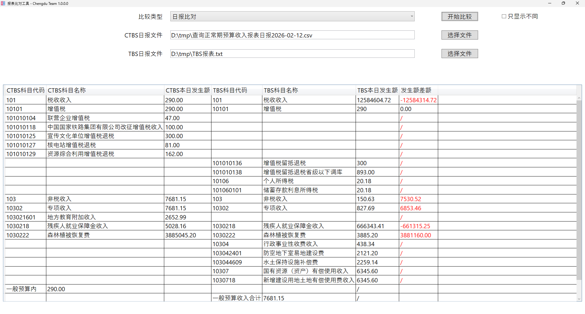

# 报表比对工具


## 功能说明

用于核对CTBS、TBS产生的报表比对，目前只支持纯文本格式文件（csv,txt等）比对，不支持Excel文件比对。

因核对的报表种类较多，工具基于配置文件对报表文件进行内容比对，在程序所有目录下的profiles文件夹可以放置多个配置文件以对应多种报表。

工具使用WPF技术进行实现，只支持Windows系统下运行。并且需要.Net Framework 4.6.1运行环境，Windows 7及以上的Windows操作系统一般自带此运行环境。


## 程序界面说明



上面是界面截图，先选择要核对报表类型，这些类型与配置文件相对应。然后选择CTBS和TBS报表文件。

点击开始比较进行对比，程序会在下面表格中列出两个文件要展示的列（根据配置文件决定展示文件中哪些列），以及根据配置计算差额。如果有的行只有一个文件中有，差额将展示“/”。如果差额不为0，或者差额为/，界面将标红此值。

勾选“只显示不同”后，将只显示标红的值。

## 配置文件说明（研发人员阅读）

### 配置文件示例如下：

```toml
[GUI]
FirstFileTitle = "CTBS日报文件"
SecondFileTitle = "TBS日报文件"

[FirstFileReadStrategy]
Encoding = "UTF-8"
Splitter = "Space"
ColumnNames = ["CTBS科目代码", "CTBS科目名称", "CTBS本日发生额"]
ColumnIndexs = [0, 1, 2]
KeyColumnIndexs = [0]

[SecondFileReadStrategy]
Encoding = "GB2312"
Splitter = "Tab"
ColumnNames = ["TBS科目代码", "TBS科目名称", "TBS本日发生额"]
ColumnIndexs = [0, 1, 7]
KeyColumnIndexs = [0]

[CompareStrategy]
AppendColumnNames = ["发生额差额"]
CalculateColumnIndexs = [2]
```

配置文件采用TOML文件格式进行编辑，因为解析此文件的程序是程序自行实现简单解析，不是标准TOML库文件（引入标准TOML库文件会导致程序目录下有大量DLL文件），因此文件中不支持增加TOML注解等。建议就以上面样例格式进行配置文件配置。

配置文件的编码格式应为UTF-8。

### 配置文件内容说明如下：

```toml
[GUI]
FirstFileTitle = "CTBS日报文件"
SecondFileTitle = "TBS日报文件"
```

GUI这一节配置的是界面上要选择的两个文件的标题，可以根据不同类型报表类型进行配置。

```toml
[FirstFileReadStrategy]
Encoding = "UTF-8"
IgnoreHeadRowCount = 6
IgnoreTailRowCount = 2
Splitter = "Space"
ColumnNames = ["CTBS科目代码", "CTBS科目名称", "CTBS本日发生额"]
ColumnIndexs = [0, 1, 2]
KeyColumnIndexs = [0]
```

FirstFileReadStrategy这一节配置第一个文件读取时的策略。

* Encoding表示报表文件编码格式，CTBS产生的报表格式为UTF-8，TBS产生报表格式为GB2312。
* Splitter文件各列的分析符，可以配置 “Space”表示以空格分隔，“Tab”表示以Tab键分隔，“Comma”表示以逗号分隔。
* ColumnNames表示在对比界面上要显示标题名。
* ColumnIndexs表示读取报表文件中哪几列在界面上进行展示，这个参数的个数必须与上面ColumnNames个数对应。这个数字对应的是文件中的列，如果文件中某几列不需要进行比对，也不需要在界面展示，就可以不配置这一列的列号。注意，列号是以0开始的，文件中的第一列在此配置为0。
* KeyColumnIndexs表示文件中哪几列作为关键列，类似于数据库主键，两个文件主键相同的列进行差额计算。
* 注意ColumnIndexs与KeyColumnIndexs均是以文件中的列号。

SecondFileReadStrategy这一节配置第二个文件读取时的策略。配置方式同上面说明。

```toml
[CompareStrategy]
AppendColumnNames = ["发生额差额"]
CalculateColumnIndexs = [2]
```

这一节为计算差额（比对结果）的配置。

* AppendColumnNames是配置计算差额列名。
* CalculateColumnIndexs表示哪些列要进行差额计算。列号是指界面上展示的列号，如上面配置中第一个文件和第二个文件各配置了三列"CTBS科目代码"（列号为0）, "CTBS科目名称"（列号为1）, "CTBS本日发生额"（列号为2）和"TBS科目代码"（列号为0）, "TBS科目名称"（列号为1）, "TBS本日发生额"（列号为2），其中第三列需要进行计划，此处配置列号为2。
* CalculateColumnIndexs可以配置多列，同样是从0开始。配置项个数需要与AppendColumnNames个数相同。


